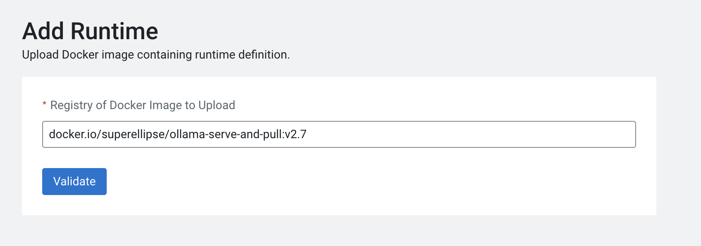

# Ollama PBJ CUDA Runtime in Cloudera Machine Learning
Ollama provides an easy mechanism to set up local selfhosted / private LLMs and multi-modal Models. This runtime is used to setup the Ollama binaries, the associated CUDA and recommended python libraries for accessing OLLAMA in Cloudera Machine Learning. 

## Why do we need this runtime?
Ollama cannot be set up by a pip install and its binary installation on Linux requires sudo access, which is not available by default in a Cloudera Machine Learning Terminal for security reasons. 
This runtime sets up Ollama, associated CUDA libraries and compatible python versions so that you can add them to your Cloudera Machine Learning workspace for use.


## Docker build for Cloudera Machine Learning 
A  build is available on dockerhub that can be accessed as follows ( needs docker login) by using the format _docker.io/your-dockerimagename-name:tag_ 

*A prebuilt version has been uploaded to the Docker hub and can can be accessed as follows*
```
docker.io/superellipse/ollama-serve-and-pull:v2.7
```
## Adding the runtime image in Cloudera Machine Learning
To add a runtime image in Cloudera Machine Learning if it does not exist already, go to the runtime catalog in control pane, and click on add runtime. you can add the details as below. Replace the runtime image with your own image details and tags if you are building your own docker image.


 <br> <br>

<br><br>
## References: 
1. Click here to know more about [Ollama](https://www.ollama.com/)
2. For more details on this process and how to add this image to Cloudera Machine Learning, please refer to this [Cloudera Documentation Page](https://docs.cloudera.com/machine-learning/cloud/runtimes/topics/ml-runtimes-overview.html)